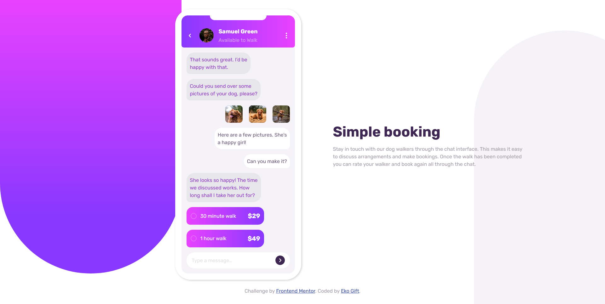

# Frontend Mentor - Chat app CSS illustration solution

This is a solution to the [Chat app CSS illustration challenge on Frontend Mentor](https://www.frontendmentor.io/challenges/chat-app-css-illustration-O5auMkFqY). Frontend Mentor challenges help you improve your coding skills by building realistic projects. 

## Table of contents

- [Overview](#overview)
  - [The challenge](#the-challenge)
  - [Screenshot](#screenshot)
  - [Links](#links)
- [My process](#my-process)
  - [Built with](#built-with)
  - [What I learned](#what-i-learned)
- [Author](#author)

## Overview

### The challenge

Users should be able to:

- View the optimal layout for the component depending on their device's screen size
- See the chat interface animate on the initial load

### Screenshot

### Links

- Solution URL: [https://github.com/Eko-U/chat-app](https://github.com/Eko-U/chat-app)
- Live Site URL: [https://eko-u.github.io/chat-app/](https://eko-u.github.io/chat-app/)

### Built with

- Semantic HTML5 markup
- CSS custom properties
- Flexbox
- CSS Grid
- CSS Animation

### What I learned
I have been able to reinforce my knowledge on Flexbox, CSS Grid, CSS Animation and the most intresting part was to put my knowlege in practice by building a custom radio button for all browsers 😊😊.

## Author

- Frontend Mentor - [@Eko-U](https://www.frontendmentor.io/profile/Eko-U)
- Twitter - [@eko_gift](https://www.twitter.com/eko_gift)